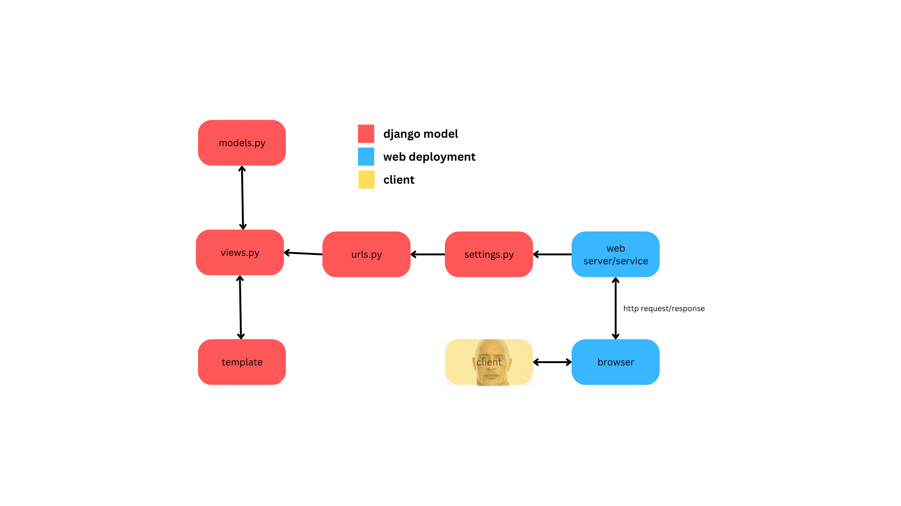
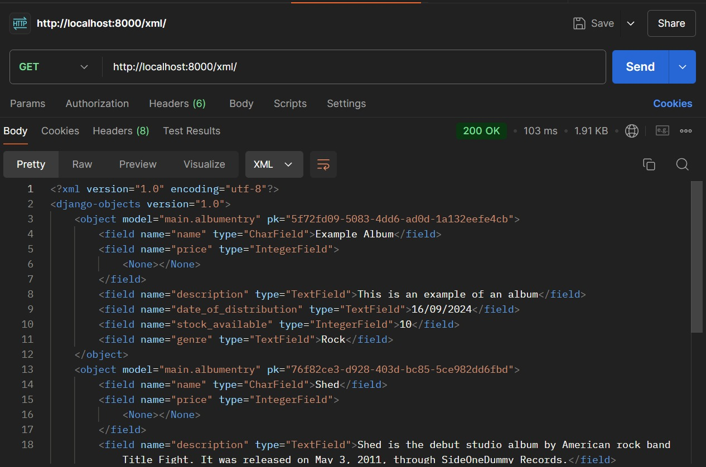
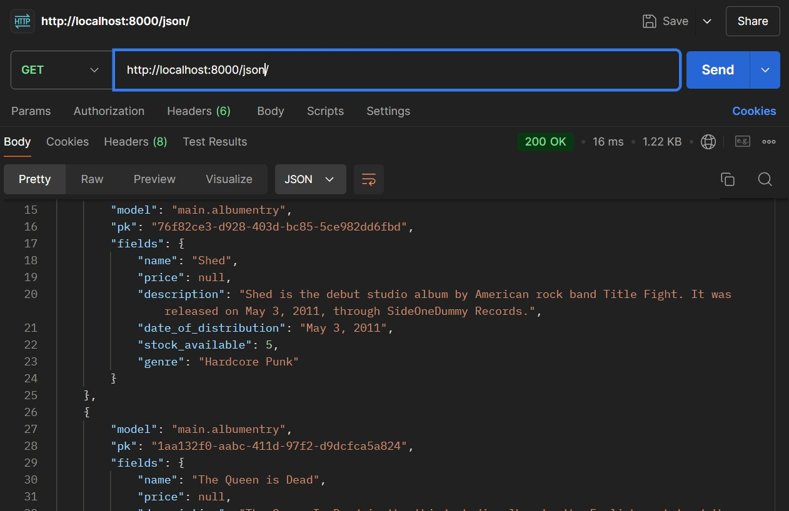
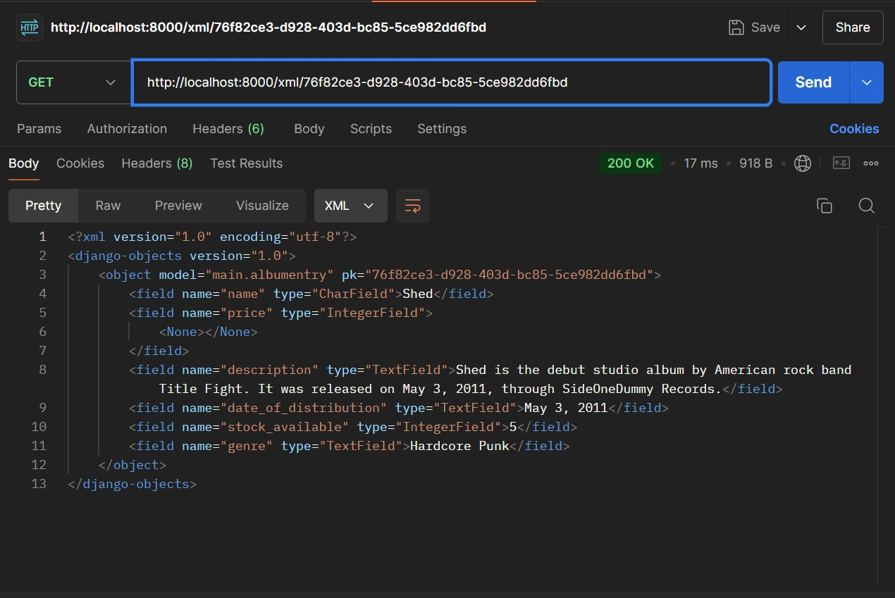
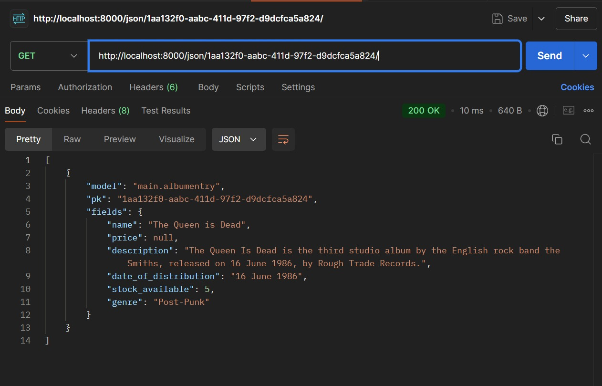

# disco-paradise
## TUGAS 2
## [Visit Disco Paradise here!](https://refalino-shahzada-discoparadisee.pbp.cs.ui.ac.id/)

### 1. Jelaskan bagaimana cara kamu mengimplementasikan checklist di atas secara step-by-step (bukan hanya sekadar mengikuti tutorial).
**JAWAB**
- Melakukan setup awal seperti menentukan nama, tema proyek dan pembuatan direktori dari proyek tersebut. Lalu install django dan membuat virtual environment. Lakukan pengecekan terhadap virtual environment jika ada masalah.
- Buat requirements.txt yang berisi dengan segala macam dependencies yang akan digunakan dalam proyek django yang akan dibuat. 
- membuat direktori proyek dengan menggunakan perintah django-admin startproject discoparadise . yang akan jadi direktori aplikasi saya.
- Membuat direktori baru bernama main dengan menggunakan perintah python manage.py startapp main . yang akan menjadi bagian utama untuk konfigurasi aplikasi saya
- Dengan terinisialisasinya main, saya lanjut membuat model dari aplikasi saya yang akan berlangsung pada models.py pada direktori main. Atribut yang saya gunakan untuk proyek saya:
```python
from django.db import models

class AlbumEntry(models.Model):
    name = models.CharField(max_length=255)
    price = models.DateField(auto_now_add=True)
    description = models.TextField()
    date_of_distribution = models.TextField()
    stock_available = models.IntegerField()
    genre = models.TextField()
```
- Setelah saya membuat model tersebut, saya melakukan imigrasi model ke basis data lokal.
- Buat folder baru di dalam direktori main bernama templates, dimana di dalam direktori ini akan diisi dengan file html bernama main.html yang akan menampilkan segala macam models yang saya buat tadi.
- Hubungkan template dengan views dengan pertama membuat fungsi show_main dalam file views.py seperti berikut: 
```python
from django.shortcuts import render

# Create your views here.
def show_main(request):
    context = {
        'name': 'Dark Side of the Moon',
        'price' : '650000',
        'description' : 'The Dark Side of the Moon is the eighth studio album by the English rock band Pink Floyd',
        'date_of_distribution' : '1 March 1973',
        'stock_available' : 10,
        'genre' : 'rock'
    }

    return render(request, "main.html", context)
```
- Buatkan routing URL aplikasi main dengan mengisi urls.py dalam direktori templates sebagai berikut:
```python
from django.urls import path
from main.views import show_main

app_name = 'main'

urlpatterns = [
    path('', show_main, name='show_main'),
]
```
- Setelah membuat routing URL aplikasi main, saya membuat routing pada proyek agar dapat dijalankan. Caranya adalah untuk mengisi file urls.py dalam direktori disco_paradise sebagai berikut:
```python
from django.contrib import admin
from django.urls import path, include

urlpatterns = [
    path('admin/', admin.site.urls),
    path('', include('main.urls')),
]
```

### 2. Buatlah bagan yang berisi request client ke web aplikasi berbasis Django beserta responnya dan jelaskan pada bagan tersebut kaitan antara urls.py, views.py, models.py, dan berkas html.
***JAWAB***

- Client mengirim request ke server
- urls.py melakukan URL routing yang menangkap request dan mengarahkan ke view yang sesuai 
- views.py memoproses request tersebut, berinteraksi dengan model dan mengembalikan response
- models.py berisi dengan model yang berinteraksi dengan database untuk mengambil dan menyimpan data
- HTML Template merupakan hasil view yang di render dengan data yang diperoleh dari model dan mengembalikan response ke client.

### 3. Jelaskan fungsi git dalam pengembangan perangkat lunak
**JAWAB**
Git memiliki beberapa fungsi untuk pengembangan perangkat lunak, beberapa dari fungsi tersebut adalah:
- Version Control: Git melacak setiap perubahan kode, sehingga developer dapat melihat riwayat versi dan bahkan beralih kepada versi sebelumnya jika ada kesalahan. Hal tersebut mungkin karena command fitur, reset dan checkout dalam git.
- Collaboration: Git membuka cara untuk melakukan kolaborasi antar developer yang mengerjakan suatu proyek bersama dengan adanya fitur branching dan merging.
- Deployment: Git memungkinkan developer untuk melakukan deployment ke production server secara mudah dengan adanya command push untuk mengirim versi terbaru dari repositori lokal ataupun pull untuk menerima versi terbaru dari server git.

### 4. Menurut Anda, dari semua framework yang ada, mengapa framework Django dijadikan permulaan pembelajaran pengembangan perangkat lunak?
***JAWAB*** 
Django dijadikan permulaan pembelajaran pengembangan perangkat lunak karena alasan sebagai berikut:
- Django sudah menyediakan banyak fitur bawaan untuk pengembangan aplikasi web
- Django dirancang utuk menangani aplikasi yang kompleks
- Django sudah menyediakan fitur berupa keamanan yang melindungi aplikasi dari ancaman
- Django memiliki komunitas yang besar hingga dapat saling tanya dan belajar

### 5. Mengapa model pada Django disebut sebagai ORM?
**JAWAB**
Model pada Django disebut ORM karena mereka berfungsi untuk menghubungkan objek-objek dalam kode Python dengan tabel-tabel pada database relasional, seperti SQL. Dengan ORM, pengembang dapat berinteraksi dengan database menggunakan objek Python tanpa harus menulis perintah SQL secara langsung.

## TUGAS 3

### 1. Jelaskan mengapa kita memerlukan data delivery dalam pengimplementasian sebuah platform?
**JAWAB**
Data delivery sangat penting untuk diimplementasikan dalam sebuah platform karena beberapa hal berikut:
- Data delivery menyediakan akses langsung kepada real-time information dimana kita sebuah platform akan dapat data dan informasi terbaru.
- Dengan adanya data delivery dan real time information yang masuk, terdapat user engagement yang lebih menarik karena rekomendasi yang sesuai dengan data yang diambil dari user.
- Dengan adanya data delivery, developer akan lebih mudah untuk menentukan gerakan kedepannya dengan segala input dan data dari user.

### 2. Menurutmu, mana yang lebih baik antara XML dan JSON? Mengapa JSON lebih populer dibandingkan XML?
**JAWAB**
Menurut saya, JSON lebih baik dibandingkan dengan XML. Alasannya juga sama dengan mengapa JSON lebih popular dibandingkan dengan XML. 
- JSON memiliki syntax yang jauh lebih simple untuk dibaca. 
- JSON memiliki format data yang lebih kecil, sehingga penguraian data lebih cepat
- JSON sudah menjadi format standar untuk mayoritas service web dan API

### 3. Jelaskan fungsi dari method `is_valid()` pada form Django dan mengapa kita membutuhkan method tersebut?
**JAWAB**
`is_valid()` adalah fungsi di dalam Django yang digunakan untuk validasi. Mayoritas fungsi `is_valid()` pada django digunakan pada forms dan model dimana dia berfungsi untuk ngecek apabila suatu data sudah valid sebelum di proses dan di simpan. 

### 4. Mengapa kita membutuhkan `csrf_token` saat membuat form di Django? Apa yang dapat terjadi jika kita tidak menambahkan `csrf_token` pada form Django? Bagaimana hal tersebut dapat dimanfaatkan oleh penyerang?
**JAWAB**
Pertama harus diketahui bahwa CSRF adalah Cross-Site Request Forgery dan csrf token adalah suatu token unik yang dibuat oleh server untukk memastikan bahwa suatu request yang sedang diproses itu aman dan diautentikasi. Jika tidak menggunakan `csrf_token`, dapat terjadi kejahatan-kejahatan seperti tindakan dari pihak asing, masalah integritas data dan ketidakamanan.

### 5. Jelaskan bagaimana cara kamu mengimplementasikan checklist di atas secara step-by-step (bukan hanya sekadar mengikuti tutorial).
**JAWAB**
***Membuat input form untuk menambahkan objek model pada app sebelumnya.***
1. Untuk menambah input form, saya pertama membuat berkas baru pada direktori `main` dengan nama `forms.py` dan saya isi dengan kode berikut:
```python
from django.forms import ModelForm
from main.models import AlbumEntry

class AlbumEntryForm(ModelForm):
    class Meta:
        model = AlbumEntry
        fields = ["name", "price", "description", "date_of_distribution", "stock_available", "genre"]
```
Penjelasan:
- `model = AlbumEntry` berfungsi untuk menunjukkan model yang akan digunakan untuk form.
- `fields = ["name", "price", "description", "date_of_distribution", "stock_available", "genre"]` berfungsi untuk menunjukkan fields yang akan diisi oleh form AlbumEntry

2. Lalu pada berkas `views.py` pada direktori `main` import `AlbumEntry` dan `AlbumEntryForms` dan membuat function baru bernama `create_album_entry` sebagai berikut:
```python
def create_album_entry(request):
    form = AlbumEntryForm(request.POST or None)

    if form.is_valid() and request.method == "POST":
        form.save()
        return redirect("main:show_main")
    
    context = {'form': form}
    return render(request, "create_album_entry.html", context)
```
Penjelasan:
- `form = AlbumEntryForm(request.POST or None)` digunakan untuk membuat entry form baru dengan memasukkan *QueryDict* berdasarkan input *user* pada `request.POST`
- `form.is_valid()` digunakan untuk validasi isi input form tersebut
- `form.save()` digunakan untuk menyimpan data dari form tersebut
- `return redirect("main:show_main")` digunakan untuk melakukan *redirect* ke fungsi `show_main` pada views aplikasi `main` setelah data form berhasil disimpan.

3. Dari tugas sebelumnya, saya mengubah fungsi `show_main` menjadi seperti berikut:
```python
def show_main(request):
    album_entries = AlbumEntry.objects.all()

    context = {
        'name': 'Dark Side of the Moon',
        'price' : '650000',
        'description' : 'The Dark Side of the Moon is the eighth studio album by the English rock band Pink Floyd',
        'date_of_distribution' : '1 March 1973',
        'stock_available' : 10,
        'genre' : 'rock',
        'album_entries': album_entries,
    }

    return render(request, "main.html", context)
```
Penjelasan:
- `AlbumEntry.objects.all()` yang dimasukkan kedalam variabel album_entries merupakan seluruh objek AlbumEntry yang disimpan pada database. 

4. Pada direktori `main`, buka berkas `urls.py` saya import fungsi `create_album_entry` yang saya buat dan tambahkan variabel baru pada urlpatterns untuk mengakses fungsi yang diimport seperti berikut:
```python
urlpatterns = [
   ...
   path('create-album-entry', create_album_entry, name='create_album_entry'),
]
```
5. Pada subdirektori `templates` di dalam direktori `main` saya buat berkas baru bernama `create_album_entry.html` yang berisi dengan kode berikut:
```html
 

<h1>Add New Album Entry</h1>

<form method="POST">
  
  <table>
    {{ form.as_table }}
    <tr>
      <td></td>
      <td>
        <input type="submit" value="Add Album Entry" />
      </td>
    </tr>
  </table>
</form>


```
Penjelasan:
- `form method="POST"` digunakan untuk menandakan block untuk form metode POST
- `` adalah token yang berfungsi sebagai security dalam rangka html tersebut untuk mencegah serangan berbahaya.
- `{{ form.as_table }}` adalah template tag yang digunakan untuk menampilkan fields form yang sudah dibuat pada `forms.py` sebagai table.
- `<input type="submit" value="Add Album Entry" />` digunakan sebagai tombol untuk menyimpan data yang sudah diisi dalam form 

6. Pada direktori sama, pada `main.html` tambahkan  untuk menampilkan data album dalam bentuk tabel dan tombol "Add New Album Entry" yang akan lakukan redirect ke halaman mengisi form sebagai berikut:
```html

<p>Belum ada data album pada Disco Paradise.</p>

<table>
  <tr>
    <th>Album Name</th>
    <th>Price</th>
    <th>Description</th>
    <th>Date of Distribution</th>
    <th>Stock Available</th>
    <th>Genre</th>
  </tr>

   Berikut cara memperlihatkan data album di bawah baris ini 
   
  
  <tr>
    <td>{{album_entry.name}}</td>
    <td>{{album_entry.price}}</td>
    <td>{{album_entry.description}}</td>
    <td>{{album_entry.date_of_distribution}}</td>
    <td>{{album_entry.stock_available}}</td>
    <td>{{album_entry.genre}}</td>
  </tr>
  
</table>


<br />

<a href="">
  <button>Add New Album Entry</button>
</a>

```
Dengan itu, pembuatan form untuk menambahkan objek model sudah selesai.

***Tambahkan 4 fungsi `views` baru untuk melihat objek yang sudah ditambahkan dalam format XML, JSON, XML by ID, dan JSON by ID.***
1. Pada direktori `main` buka berkas `views.py` dan import `HttpResponse` dan `serializers` sebagai berikut:
```python
from django.http import HttpResponse
from django.core import serializers
```

2. Untuk melihat objek yang sudah ditambahkan dalam format XML, JSON, XML by id dan JSON by id buatlah fungsi baru untuk masing-masing keperluan sebagai berikut:
**UNTUK XML**
```python 
def show_xml(request):
    data = AlbumEntry.objects.all()
    return HttpResponse(serializers.serialize("xml", data), content_type="application/xml")
```
**UNTUK JSON**
```python
def show_json(request):
    data = AlbumEntry.objects.all()
    return HttpResponse(serializers.serialize("json", data), content_type="application/json")
```

**UNTUK XML by id**
```python
def show_xml_by_id(request, id):
    data = AlbumEntry.objects.filter(pk=id)
    return HttpResponse(serializers.serialize("xml", data), content_type="application/xml")
```

**UNTUK JSON by id***
```python
def show_json_by_id(request, id):
    data = AlbumEntry.objects.filter(pk=id)
    return HttpResponse(serializers.serialize("json", data), content_type="application/json")
```

3. Lalu pada berkas `urls.py` pada direktori `main` import semua fungsi tersebut serta tambahkan path url untuk mengakses masing-masing fungsi seperti berikut:

### 6. Mengakses keempat URL di poin 2 menggunakan Postman, membuat screenshot dari hasil akses URL pada Postman, dan menambahkannya ke dalam `README.md`.

Pada XML:


Pada JSON:


Pada XML by ID:


Pada JSON by ID:


## TUGAS 4
### 1. Apa itu Django `UserCreationForm`, dan jelaskan apa kelebihan dan kekurangannya?
UserCreation form pada django merupakan sistem autentikasi yang dibuat langsung di dalam frameworknya. Fungsinya untuk membuat user baru dengan menggunakan username, password dan password confirmation.

***Kelebihan:**
- UserCreationForm merupakan bawaan dari Django hingga mudah untuk diakses dan digunakan
- Kemanan sistem yang sangat baik karena password hashing
- Form autentikasinya dapat disesuaikan dengan kemauan user

**Kekurangan:**
- Hanya memiliki form username dan password, jika ingin lebih banyak form harus di extend
- Form default tidak memiliki UX yang baik, kekurangan indikator kekuatan password dan sebagainya.
- Biarpun form dapat di extend untuk memiliki lebih banyak field, tetap sulit dan membutuhkan pemahaman Django yang cukup banyak

### 2. Apa perbedaan antara autentikasi dan otorisasi dalam konteks Django, dan mengapa keduanya penting?
Autentikasi dan otorisasi adalah 2 konsep berbeda namun saling terkait dan keduanya sangat penting dalam menjaga keamanan aplikasi. 

**Autentikasi**
Autentikasi adalah proses memverifikasi identitas pengguna. Dalam kata lain menentukan siapa yang masuk ke sistem. Sebagai contoh dari proses autentikasi adalah ketika pengguna masukkan username dan password pada halaman login, Django menggunakan sistem autentikasi bawaan untuk memverifikasi apakah kredensial tersebut cocok dengan data yang disimpan pada database.

**Otorisasi**
Otorisasi adalah proses untuk menentukan apa yang bisa dilakukan oleh pengguna yang telah diautentikasi. Otorisasi menentukan izin dan hak akses yang dimiliki oleh pengguna. Sebagai contoh dari proses otorisasi adalah ketika pengguna masuk ke akun mereka, otorisasi memeriksa apakah pengguna tersebut memiliki izin untuk mengakses halaman admin, mengedit data, menghapus konten. 

**Mengapa keduanya penting**
Ada beberapa alasan mengapa kedua hal tersebut penting, beberapa dari hal tersebut adalah:
- Keamanan aplikasi: Autentikasi memastikan hanya pengguna yang sah yang dapat masuk ke dalam sistem dan otorisasi akan memastikan bahwa pengguna tersebut hanya bisa mengakses bagian yang diizinkan kepada mereka.
- Privasi dan hak akses: Otorisasi menjaga agar pengguna hanya bisa mengakses data dan fitur yang relevan dengan peran atau izin mereka. 
- User experience: Dengan memisahkan autentikasi dan otorisasi, aplikasi dapat memberikan user experience yang lebih aman dan terstruktur.

### 3. Apa itu cookies dalam konteks aplikasi web, dan bagaimana Django menggunakan cookies untuk mengelola data sesi pengguna?
**Apa itu cookies dalam konteks aplikasi web?**
Cookies adalah file kecil yang disimpan oleh browser di perangkat pengguna ketika mereka mengunjungi situs web. Cookies digunakan untuk menyimpan data kecil yang bisa dikirim kembali ke server setiap kali pengguna membuat permintaan baru. Cookies membantu aplikasi web untuk mengingat pengguna atau informasi tentang sesi mereka saat berpindah-pindah antara halaman atau ketika kembali ke situs di lain waktu.

**Bagaimana Django menggunakan cookies untuk mengelola data sesi pengguna?**
Django menggunakan cookies untuk mengelola sesi pengguna, sehingga situs web dapat mengingat pengguna di antara permintaan HTTP. Sebagai contoh, dengan sistem sesi Django, pengguna dapat memiliki preferensi terhadap sesuatu yang diingat dan tidak harus dikirim ulang di setiap halaman. Untuk bagaimana cara kerjanya sebagai berikut:
  1. Ketika pengguna pertama kali mengunjungi aplikasi Django, cookie `sessionid` disimpan di browser mereka, cookie ini berisi dengan ID sesi unik yang dihasilkan secara acak.
  2. Django menyimpan data sesi pengguna di server. Data yang disimpan bisa berupa status login atau informasi sementara lainnya. ID sesi yang disimpan ini memungkinkan Django untuk mengambil dan menggunakan data sesi ketika pengguna mengirim permintaan baru.
  3. Setiap kali pengguna mengirim permintaan HTTP, Django membaca cookie `sessionid` dari broser tersebut. Jika cocok, Django akan mengembalikan data sesi yang terkait dengan pengguna tersebut. Jika sesi pengguna berakhir atau logout, Django akan menghapus data sesi di server dan cookie `sessionid`.
  4. Django menggunakan cookies untuk keamanan, dengan menerapkan token CSRF untuk mencegah serangan Cross-Site Request Forgery. Ini melibatkan penyimpenan token CSRF di cookie, yang kemudian diverifikasi setiap kali pengguna mengirimkan permintaan POST.

### 4. Apakah penggunaan cookies aman secara default dalam pengembangan web, atau apakah ada risiko potensial yang harus diwaspadai?
Penggunaan cookies dalam pengembangan web tidak sepenuhnya aman secara default. Ada beberapa risiko yang harus diwaspadai, terutama karena cookies dapat digunakan untuk menyimpan data sensitif. Beberapa risiko potensial dalam penggunaan cookies adalah:
- XSS atau Serangan Cross-Site Scripting dimana penyerang mengimplementasikan sebuah skrip berbahaya ke dalam aplikasi web yang dapat mengambil data sesi pengguna sebuah pengguna
- Serangan CSRF atau Cross-Site Request Forgery adalah serangan di mana penyerang mencoba membuat pengguna yang sudah terautentikasi mengirimkan permintaan yang tidak sah kepada server tanpa sepengetahuan mereka. 
- Serangan cookie theft terjadi ketika penyerang mencuri cookie dari pengguna, biasanya melalui jaringan yang tidak aman seperti Wi-Fi publik.

### 5.  Jelaskan bagaimana cara kamu mengimplementasikan checklist di atas secara step-by-step (bukan hanya sekadar mengikuti tutorial).
**Mengimplementasikan fungsi registrasi, login, dan logout untuk memungkinkan pengguna untuk mengakses aplikasi sebelumnya dengan lancar.**
  1. Membuat fungsi dan form registrasi
  Pada file `views.py` saya import `UserCreationForm` dan `messages`. Kemudian saya tambahkan fungsi `register` pada file yang sama seperti berikut:
  ```python
  def register(request):
    form = UserCreationForm()

    if request.method == "POST":
        form = UserCreationForm(request.POST)
        if form.is_valid():
            form.save()
            messages.success(request, 'Your account has been successfully created!')
            return redirect('main:login')
    context = {'form':form}
    return render(request, 'register.html', context)
  ```
  Dimana fungsi ini akan menghasilkan form registrasi secara otomatis dan akan menghasilkan akun pengguna ketika di submit dari form. Setelah itu, saya membuat kerangka halaman registrasi dengan membuat file html baru bernama `register.html` dengan isi berikut:
  ```html
  

  
  <title>Register</title>
  

  

  <div class="login">
    <h1>Register</h1>

    <form method="POST">
      
      <table>
        {{ form.as_table }}
        <tr>
          <td></td>
          <td><input type="submit" name="submit" value="Daftar" /></td>
        </tr>
      </table>
    </form>

    
    <ul>
      
      <li>{{ message }}</li>
      
    </ul>
    
  </div>

  
  ```
  Html tersebut yang akan menjadi kerangka dari halaman register saya. Kemudian saya hubungkan form register serta kerangkanya dengan url tertentu dengan membuka `urls.py` dan menambahkan path untuk register.

  2. Membuat fungsi dan form login
  Sebelum mulai, saya import `Authenticate`, `login`, dan `AuthenticationForm` pada berkas `views.py` kemudian menambahkan fungsi `login_user` pada berkas yang sama seperti berikut:
  ```python
  def login_user(request):
   if request.method == 'POST':
      form = AuthenticationForm(data=request.POST)

      if form.is_valid():
            user = form.get_user()
            login(request, user)
            return redirect('main:show_main')

   else:
      form = AuthenticationForm(request)
   context = {'form': form}
   return render(request, 'login.html', context)
   ```
  Setelah saya membuat fungsi login, saya membuat kerangka yang akan di display di website dengan file html baru bernama `login.html` yang berisi sebagai berikut:\
  ```html
  

  
  <title>Login</title>
  

  
  <div class="login">
    <h1>Login</h1>

    <form method="POST" action="">
      
      <table>
        {{ form.as_table }}
        <tr>
          <td></td>
          <td><input class="btn login_btn" type="submit" value="Login" /></td>
        </tr>
      </table>
    </form>

    
    <ul>
      
      <li>{{ message }}</li>
      
    </ul>
     Don't have an account yet?
    <a href="">Register Now</a>
  </div>

  
  ```
  Kemudian saya routing kerangka dan fungsi tersebut dengan import fungsi `login_user` dan menambahkan path url baru pada `urlpatterns`

  3. Membuat fungsi logout
  Pada `views.py`, saya import `logout` dan menambahkan fungsi `logout_user` yang berfungsi sebagai mekanisme logout seperti berikut:
  ```python
  def logout_user(request):
    logout(request)
    return redirect('main:login')
  ```
  Kemudian pada berkas `main.html` saya tambahkan button logout seperti berikut:
  ```html
  <a href="">
    <button>Logout</button>
  </a>
  ```
  Kemudian pada `urls.py` saya import fungsi `logout_user` dan tambahkan url path baru pada `urlpatterns` dengan url baru untuk logout.

  4. Merestriksi Akses Halaman Main Sebelum Login
  Pada berkas `views.py` saya import `login_required` dan tambahkan potongan kode `login_required` sebelum fungsi `show_main` seperti berikut:
  ```python
  @login_required(login_url='/login')
  ```

**Membuat dua akun pengguna dengan masing-masing tiga dummy data menggunakan model yang telah dibuat pada aplikasi sebelumnya untuk setiap akun di lokal.**
  Dengan implementasinya feature register, login dan logout, untuk membuat dua akun pengguna saya menggunakan feature register saya untuk membuat 2 akun pengguna. Kemudian pada tiap pengguna saya menambahkan album entry sebanyak 3 album.

**Menghubungkan model Product dengan User.**
  1. Pada `models.py` saya import `User` dan ubah variabel user menjadi sebagai berikut:
  ```python
  user = models.ForeignKey(User, on_delete=models.CASCADE)
  ```
  2. Pada `views.py` saya ubah potongan kode pada fungsi `create_album_entry` sebagai berikut:
  ```python
  def create_album_entry(request):
    form = AlbumEntryForm(request.POST or None)

    if form.is_valid() and request.method == "POST":
        album_entry = form.save(commit=False)
        album_entry.user = request.user
        album_entry.save()
        return redirect("main:show_main")
    
    context = {'form': form}
    return render(request, "create_album_entry.html", context)
  ```
  3. Saya ubah value pada variabel `album_entries` dan `context` pada fungsi `show_main` seperti berikut:
  ```python
  def show_main(request):
    album_entries = AlbumEntry.objects.filter(user=request.user)

    context = {
        'name': request.user.username,
        'price' : '650000',
        'description' : 'The Dark Side of the Moon is the eighth studio album by the English rock band Pink Floyd',
        'date_of_distribution' : '1 March 1973',
        'stock_available' : 10,
        'genre' : 'rock',
        'album_entries': album_entries,
        'last_login': request.COOKIES['last_login'],
    }

    return render(request, "main.html", context)
  ```
  4. Lakukan migrasi model pada Django menggunakan `python manage.py makemigrations` dan menetapkan user yang sudah ada dengan ID 1. Kemudian lakukan `python manage.py migrate` untuk mengaplikasikan migrasi yang dilakukan pada poin sebelumnya. Kemudian saya setup aplikasi web kita untuk environment production dengan import `os` pada `settings.py` di subdirektori `disco_paradise` kemudian ganti variabel `DEBUG` seperti berikut:
  ```python
  PRODUCTION = os.getenv("PRODUCTION", False)
  DEBUG = not PRODUCTION
  ```

**Menampilkan detail informasi pengguna yang sedang logged in seperti username dan menerapkan cookies seperti last login pada halaman utama aplikasi.**
  1. Pada `views.py` import `HttpResponseRedirect`, `reverse` dan `datetime`
  2. Tambahkan fungsionalitas menambahkan cookie pada fungsi  `login_user` bernama `last_login` dengan menggantikan kode sebagai berikut:
  ```python
  def login_user(request):
    if request.method == 'POST':
        form = AuthenticationForm(data=request.POST)

        if form.is_valid():
            user = form.get_user()
            login(request, user)
            response = HttpResponseRedirect(reverse("main:show_main"))
            response.set_cookie('last_login', str(datetime.datetime.now()))
            return response
  ```
  Setelah itu, pada fungsi `show_main` saya tambahkan potongan kode `last_login` seperti berikut:
  ```python
  'last_login': request.COOKIES['last_login'],
  ```
  Saya ubah fungsi `logout_user` seperti berikut:
  ```python
  def logout_user(request):
    logout(request)
    response = HttpResponseRedirect(reverse('main:login'))
    response.delete_cookie('last_login')
    return response
  ```
  3. Tambahkan kerangka pada `main.html` untuk display sesi terakhir login anda.